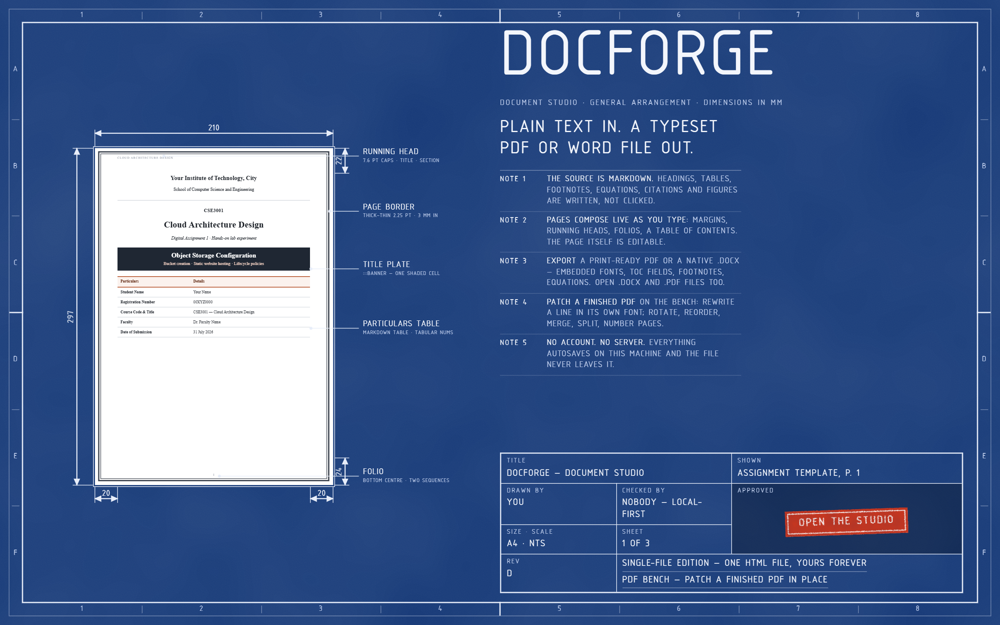
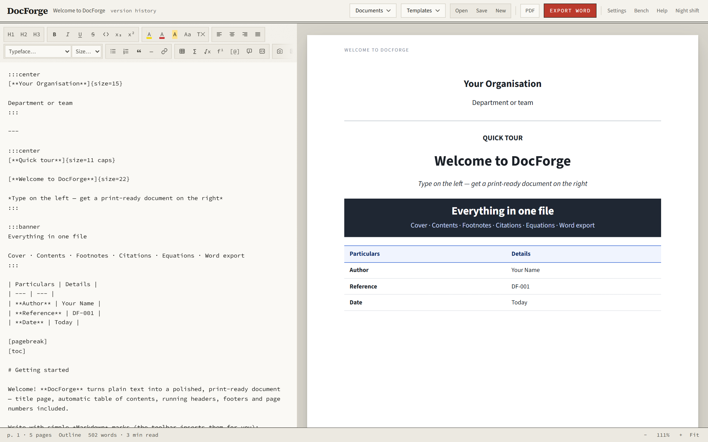
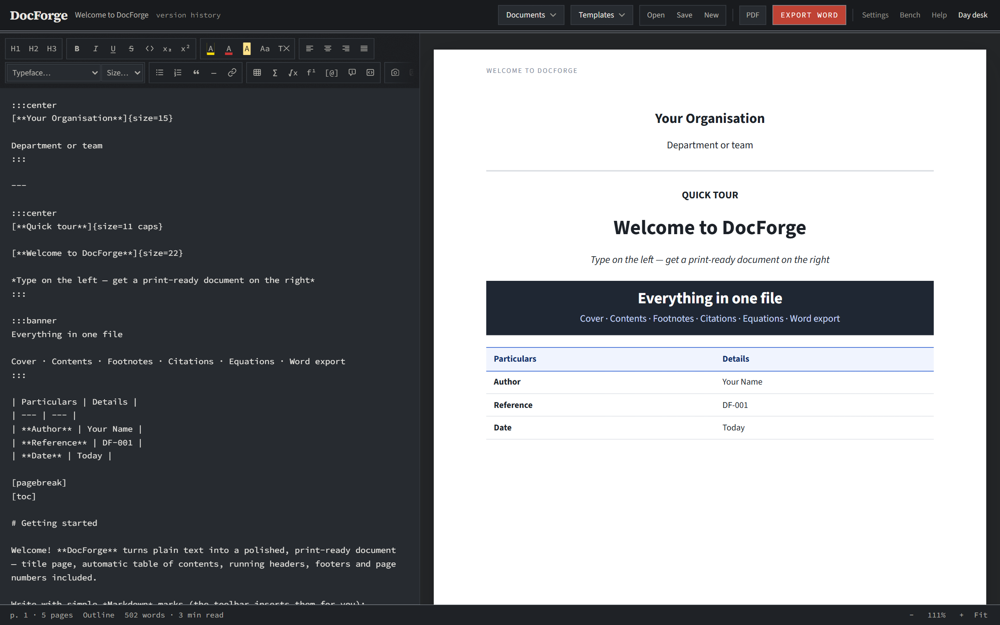

<div align="center">

# DocForge

### Plain text in. A typeset PDF or Word file out.

A local-first document studio: write Markdown, get print-ready **PDFs** and native **.docx** files with cover pages, real table of contents, running heads, footnotes, citations, equations and cross-references. No account, no server, works offline.

[](https://docforge-io.vercel.app/studio)

[](https://github.com/rakshit-737/docforge/actions/workflows/ci.yml)
[](https://github.com/rakshit-737/docforge/actions/workflows/golden.yml)
[](LICENSE)


[Live studio](https://docforge-io.vercel.app/studio) · [Markup reference](docs/DIALECT.md) · [Contributing](CONTRIBUTING.md) · [Issues](https://github.com/rakshit-737/docforge/issues)

<br>



</div>

## Screenshots

<table>
<tr>
<td width="50%"></td>
<td width="50%"></td>
</tr>
<tr>
<td align="center"><sub><b>The desk</b> — source on the left, composed pages on the right</sub></td>
<td align="center"><sub><b>Night shift</b> — dark chrome; the document always prints on white</sub></td>
</tr>
</table>

## Two editions, one engine

DocForge ships twice, from one set of typed packages:

- **The web studio** (`apps/web`) — the engine mounted in a Next.js app: CodeMirror source pane, paginated preview, live editing on the pages, IndexedDB persistence with crash recovery, one-click exports, installable PWA that keeps working offline. **Live at [docforge-io.vercel.app](https://docforge-io.vercel.app).**
- **The forever edition** — a single self-contained HTML file (`dist/DocForge.html`, ~7 MB) that works from `file://` with the network cable cut. GitHub Pages serves the current build at the site root and the frozen 1.x classic at `/classic`. Until the web studio's feature-parity audit completes (see Known limitations), this edition is the reference behaviour.

**Get started:** open [the hosted studio](https://docforge-io.vercel.app/studio), or build `dist/DocForge.html` with `node build.mjs` and open it in Chrome or Edge. For local development: `corepack pnpm --filter @docforge/web dev`.

## Local-first, and provably so

These are commitments, not marketing (MASTER-PROMPT §5):

- **Documents never leave the device.** Everything — parsing, pagination, PDF and Word export, imports, PDF editing — runs in your browser. Watch the network tab: local mode makes no requests.
- **No accounts, no walls.** Nothing is gated behind sign-in. Cloud sync, if it ever arrives, will be optional and additive — local stays the source of truth.
- **No telemetry in the single-file build.** None. The hosted app may one day carry privacy-respecting analytics; if it does, it will be disclosed.
- **The single-file edition is truly single-file** — no CDN, no runtime fetches, works from `file://`, forever.
- **Fonts stay OFL-licensed** with licence texts shipped in `fonts/`.

## What it does

- **Live paginated preview** — see actual A4/Letter pages, page numbers and all, as you type
- **Edit the manuscript directly** — the pages are a real editing surface, not a preview: click into any paragraph, heading, list, table cell or callout and type. The Markdown source keeps itself in step, pagination recomposes around your caret when you pause, and the viewport never jumps back to page 1. Generated furniture (contents page, reference list, resolved cross-references, equations, figures) stays read-only on the page; edit those from the source panel. One undo history covers both panes (Ctrl+Z anywhere)
- **Markdown + toolbar editor** — `# headings`, `**bold**`, lists, tables, quotes, code
- **Bring your own typeface** — add a `.ttf` or `.otf` in Settings and it becomes a first-class face: selectable in the pickers, drawn in the preview and the PDF, and **embedded in the Word file** exactly like the built-ins, so the document looks the same on a machine that has never heard of the font. Upload the Bold and Italic files too and the real cuts travel with it (fonts live on your device, never inside the project file)
- **Real typography** — seven embedded open-licence typefaces (see *Fonts* below) used identically in the PDF and the Word file, so the two exports look like the same document on any machine; curly quotes, en dashes and non-breaking spaces applied automatically; widow/orphan control; headings never stranded at a page foot; long tables repeat their header row on every page in both formats
- **Running header & footer, yours to set** — leave them alone for the house style (title left, current section right), or write your own with `{title}` `{author}` `{date}` `{kicker}` `{section}` tokens; `{section}` stays live, following the document as it goes. Identical in the PDF and the Word file — the same live section field on both sides. Page numbers stay in the footer's centre, the one place both formats can count front matter and body separately
- **Professional page numbering** — the cover is unnumbered, the contents page runs in romans (i, ii…), and the body starts at "Page 1 of N" where N counts body pages only; identical scheme in Word
- **Footnotes** — `[^1]` calls with `[^1]: text` definitions; placed at the foot of the correct page in the PDF and exported as real Word footnotes
- **Citations** — `[@key]` in text, `[@key]: Full entry` definitions, `[references]` for the list; numeric `[1]` (IEEE-like) or Author–year (APA-like) style, chosen in Settings; locators like `[@key, p. 33]` supported. **Drop a `.bib`, `.ris` or Zotero CSL-JSON export** and its entries merge in as definitions you can cite — entries you already defined are never overwritten, and the studio says which of the new ones nothing cites yet
- **An equation palette** — search the symbols by what they *do* (“fraction”, “implies”, “tolerance”, “power”), see each one drawn as it will print, and insert correct LaTeX with the caret where the writing continues — it brings its own `$…$` unless you are already inside maths
- **Mathematics** — `$inline$` and `$$display$$` LaTeX, rendered with KaTeX in the preview/PDF and exported to Word as **real editable equations** (OMML), not pictures
- **Cross-references** — `[#fig:name]`, `[#tbl:name]`, `[#sec:name]` resolve to "Figure 3", "Table 1", "Section 2.1"
- **Table captions** — `[table: caption]` above a table numbers it as *Table N*; `[lof]` and `[lot]` print lists of figures and tables
- **Syntax highlighting** — name a language on a code fence (` ```python `) for print-friendly colouring in both exports (36 common languages)
- **Screenshot placeholders** — `[screenshot: caption]` prints as a neat labelled box, or click it in the preview to attach the real image
- **Automatic table of contents** — `[toc]` with dotted leaders and real page numbers
- **Cover page** — title, subtitle, author, date, course/company label; full-bleed accent band in the PDF *and* the Word file
- **Save a look, apply it anywhere** — name this document’s appearance (theme, accent, page, typefaces, size, leading, borders, the running head, the citation style) and apply it to any other document, or share it with a classmate as a small JSON file. A saved look carries no title, author or date — the content is always the document’s own
- **Watermark & letterhead** — stamp DRAFT or CONFIDENTIAL diagonally across every page, and stand your department's logo in the top margin. Both print in the PDF *and* in the .docx (Word gets a real watermark shape and a real header image), both leave the cover to its own design, and a document that asks for neither is byte-for-byte the document it always was
- **4 themes** (Modern, Executive, Academic, Minimal) × any accent colour × A4/Letter × portrait or landscape × 3 margin presets
- **Callouts** — `:::note`, `:::tip`, `:::warning`, `:::important` — tables, lists and code inside them survive into Word intact; `:::banner` sets a filled title plate
- **Word's Home ribbon** — underline, strikethrough, highlighter in Word's 15 colours, sub/superscript, text colour / shading / per-selection size and typeface, small caps and all caps, alignment blocks, change-case and clear-formatting — every one lands identically in the PDF and as real run properties in the .docx
- **Open or drop several files at once** — each becomes its own document, one after another rather than all at once, and the one you were writing stays where it is
- **Import nearly anything** (in the spirit of [MarkItDown](https://github.com/microsoft/markitdown), entirely offline) — open or drop a `.docx`, `.pdf`, `.md`, `.txt`, `.html`, `.csv`/`.tsv`, `.xlsx`, `.pptx`, `.epub`, `.ipynb` or an image and it becomes editable Markdown. OOXML and EPUB packages are opened with the browser's own zip machinery — no extra libraries shipped. PDFs offer two roads: **edit in place** (below) or conversion to editable Markdown
- **A PDF toolbox** — on the bench: rotate, delete, reorder, merge another PDF in, split ranges into their own files, and stamp page numbers into the pages. Every operation runs on the bytes in your browser and lands back on the bench, so you can see what you did
- **Edit PDFs in place** — **double-click any printed line to rewrite it** and it reappears at the same position, size **and in the PDF's own embedded font** — the editor inverts the font's ToUnicode map and writes glyph codes through the page's original font resource. Also: free text boxes, white-out, highlighter, image stamps; export rebuilds from the *original bytes* with only your edits drawn on top. Two honest limits: text doesn't reflow, and a rewritten line's original characters remain in the file's hidden text layer — don't use it to redact secrets
- **Smart paste** — paste a spreadsheet range and it lands as a table; paste a URL over selected text and the text becomes the link; paste from Word or a web page and it arrives as clean Markdown; paste an image and it becomes an attached, captioned figure. One Ctrl+Z always puts back exactly what was on the clipboard
- **Slash commands** — type `/` at the head of a line and the dialect offers itself: `/table 3x4`, `/figure`, `/equation`, `/callout warning`, `/citation`, `/code python`. The menu explains each construct as you scroll it
- **Focus & flow** — the wire ticker counts what the manuscript amounts to (prose words, not the markup around them) with a reading time; click it for the breakdown — headings, figures, tables, equations, footnotes, works cited — or set a session goal that counts from *now*, so opening a long draft never reads as a goal already met. In focus mode the line you are writing stays near the middle of the pane
- **Editor comforts** — command palette (Ctrl+K), focus mode, a draggable split that remembers its place, folio readout, outline navigator, find & replace, pasted Word/web content auto-converted to Markdown, a gentle structure checker, and a light/dark switch for the app chrome (the document always prints on white)
- **Export PDF** — via the browser print engine (*Save as PDF*), margins and headers pre-configured; text stays selectable and searchable
- **Export Word** — a real `.docx` with the same fonts embedded, styled headings, cover, tables with true column widths, figures, footnotes, equations and an auto-updating TOC field
- **Export a standalone web page** — one `.html` file carrying the document, the product stylesheet, the embedded typefaces and KaTeX's maths fonts. It opens anywhere, forever, with no network and no DocForge — the same promise the single-file edition makes for the app
- **Export Markdown** — the document handed back as a plain `.md` file; with Open, that's a MarkItDown-style converter that runs entirely offline
- **Templates** — one house style across the set, each a working specimen rather than a bare skeleton: assignment/lab report, business proposal, project report, formal letter, article/essay, and a guided quick tour
- **Installed, it behaves like an app you own** — double-click a `.md` or `.docforge.json` and it opens in DocForge as its own document, with the file kept open so Save writes straight back to it; text and links shared to DocForge arrive as a new document too
- **Autosave** in the browser + `.docforge.json` project files (images included) you can reopen anywhere

The full markup reference — every construct, with the golden-corpus document that pins it — lives in [`docs/DIALECT.md`](docs/DIALECT.md). The dialect only ever grows; existing markup never changes meaning.

## The monorepo

```
apps/
  web/            the studio — Next.js App Router, React 19, Tailwind 4, CodeMirror 6, Zustand
packages/
  engine/         dialect → typed AST → HTML; themes; typography (the parser is the contract;
                  publishable to npm alongside mathml-omml)
  export-docx/    AST → .docx: embedded fonts, styles, cover band, OMML, TOC field
  importers/      docx/pdf/xlsx/pptx/epub/ipynb/csv/html/image → dialect markdown
  pdf-editor/     the in-place PDF bench (ToUnicode inversion, original-byte export)
  mathml-omml/    KaTeX MathML → Word OMML converter (own work, MIT — publishable to npm)
  config/         shared tsconfig / tooling presets
src/              the classic shell (index.html, app.css, doc.css, main.js, live-edit.js)
                  — consumes the packages; build.mjs inlines it all into dist/DocForge.html
fonts/            26 TTF cuts of 7 OFL families + licence texts
qa/               headless Playwright suites driving the real UI; qa/golden/ is the merge gate
docs/             phase plans, the bug ledger, DIALECT.md
```

`doc.css` and the document dialect are product surface: no cleanups that change rendered output. The engine runs in Node with no browser — that's what makes the unit tests (and an eventual CLI) possible.

## Quickstart

```bash
corepack enable
corepack pnpm install                      # Node 24 (.nvmrc), pnpm via corepack — no npm/yarn
node build.mjs                             # → dist/DocForge.html, the forever edition
corepack pnpm --filter @docforge/web dev   # the studio at localhost:3000
```

Other useful commands: `corepack pnpm lint` (Biome), `corepack pnpm typecheck`, `corepack pnpm test` (Vitest across packages), `corepack pnpm golden` (the merge gate, below).

## The golden-master gate

"It looks about the same" is never acceptance. The output contract is enforced mechanically (`qa/golden/README.md`):

```bash
node qa/golden/run.mjs --against v1-classic
```

A corpus of torture documents (`qa/golden/corpus/`, one per dialect cluster) is rendered through the real UI in headless Chromium on **both** sides — HEAD, and the `v1-classic` tag rebuilt fresh in a throwaway worktree — and compared on three surfaces: a screenshot of every rendered page, the print-engine PDF rasterised per page, and the exported `.docx` unzipped with its XML normalised and hashed. Pass = identical hashes, or pages within 0.1% differing pixels. Failures get magenta diff masks in `qa/out/golden/diff/`. The baseline is never stored in git — it's the tag itself, rebuilt on the same machine, so platform font rasterisation can't fake a regression. CI runs this on every push and PR.

## CI reality

Three workflows, all on every push to `main` (and PRs where noted):

- **`ci.yml`** — Biome lint, workspace typecheck, unit tests with the engine byte-parity suite armed (`RUN_PARITY=1`), then builds both editions (single-file + web studio). Push + PR.
- **`golden.yml`** — the golden-master comparison against `v1-classic`; diff masks and manifests uploaded as an artifact on failure. Push + PR.
- **`pages.yml`** — builds the current edition and the `v1-classic` edition (in its own worktree, with its own committed lockfile) and deploys both to GitHub Pages: current at `/`, classic at `/classic`.

## Fonts

The app embeds subsets of seven families — **Source Sans 3**, **Source Serif 4**, **Source Code Pro**, **Inter**, **Montserrat**, **EB Garamond** and **Crimson Pro** (all SIL Open Font License 1.1 — licence texts in `fonts/`). The same TTF bytes serve the preview, the printed PDF and the `.docx` (only the families a document actually uses are embedded in its package), which is what keeps the two exports visually identical. Rebuild the subsets with `python tools/build_fonts.py`.

Below the embedded faces, the pickers carry the whole classic **Word font menu** — ~190 families in specimen-book groups. These are proprietary, so they cannot travel inside the file: the preview uses the locally installed font and the `.docx` names the family, letting Word supply its own copy — exact parity on any machine with Office; a machine without the font sees a same-class fallback, and fonts not installed on the current device are labelled as such in the menu.

## Page borders

Settings → Page border offers seven styles (rule, double, triple, dashed, dotted, thick–thin, thin–thick) × three weights × ink or accent colour. The PDF draws the frame 4.5 mm inside the paper edge; the `.docx` gets real Word page borders at the same standoff. The cover stays full-bleed and unframed in both.

## Known limitations

- **PDF bookmarks:** the printed PDF has no outline panel. Chrome's *Save as PDF* dialog cannot emit one — no CSS or DOM feature reaches it. The fix is a direct PDF export path that skips the print dialog, tracked as [#9](https://github.com/rakshit-737/docforge/issues/9).
- **Word ≠ PDF line breaks:** the two engines break lines and pages independently, so page totals can differ by a page or two on long documents; the *design* — fonts, colours, spacing, numbering scheme — is the same.
- **APA labels** are derived mechanically from the entry text (surname before the first comma, first year found). Two works by the same author in the same year are not disambiguated — a real CSL engine is the answer, tracked as [#10](https://github.com/rakshit-737/docforge/issues/10).
- **PDF import is a reconstruction:** a PDF stores positioned glyphs, not paragraphs. Headings, lists and prose are rebuilt heuristically; tables and multi-column layouts flatten to running text, and scanned PDFs (no text layer) need OCR first. Word import is far more faithful — prefer the `.docx` when both exist.
- **Redaction on the PDF bench is cosmetic:** a rewritten line's original characters remain in the file's hidden text layer beneath the cover. Don't use it to hide secrets.
- **Compound page borders in Word** (double, triple, thick–thin, thin–thick): Word's own renderer fills the gap between the component lines with a dark tone — a document built natively in Word's *Design → Page Borders* dialog prints the same way. The PDF draws the gaps crisply.
- **Math in Word:** a handful of LaTeX constructs degrade gracefully (colours dropped, `\\` line breaks outside environments become wide gaps, `\hline` in arrays omitted). Everything exports as a real equation, never an image.
- **The web studio is not yet at full parity with the classic edition.** The Appendix-A audit (MASTER-PROMPT) is in progress: several classic surfaces — per-selection font menus in the toolbar, the image attach flow, the structure linter, focus mode, the mobile layout — are not yet built in `apps/web`, and the golden corpus has not yet been captured through the web render path. The single-file edition retires nothing until every box is checked.

## Contributing

See [`CONTRIBUTING.md`](CONTRIBUTING.md) — the short version: Node 24 + corepack pnpm, the golden gate is merge law, the dialect is additive-only, and parity is proven, never claimed.

Built with [marked](https://github.com/markedjs/marked), [Paged.js](https://pagedjs.org/), [docx](https://github.com/dolanmiu/docx), [KaTeX](https://katex.org/) and [highlight.js](https://highlightjs.org/). The MathML→OMML converter is DocForge's own (MIT, `packages/mathml-omml`). MIT licensed.

---

*Built with Claude — so the documents keep coming even when the subscription doesn't.* 🙂
